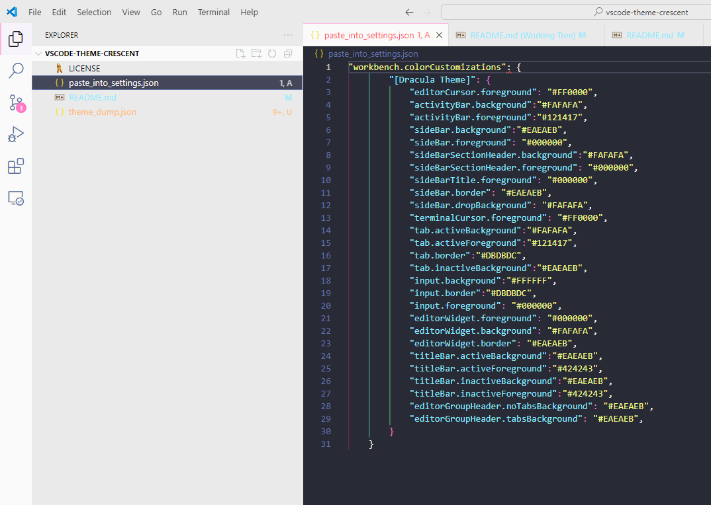

# vscode-theme-crescent
VSCode theme combining Dracula dark editor colors with Atom One Light top/side bars.

Goal is to maintain the readability and easy-on-the-eyes qualities of a dark theme while making it a bit less blinding when you switch from your editor to a white webpage.  Also makes for a slightly cheerier vibe than the usual all-black dark themes.

Named Crescent because the open white shape surrounding a dark space evokes a crescent moon.

WIP, very jank, no plans for fixes/adjustments at this time.

Copy from paste_into_settings.json into your VSCode User Settings Json while using the Dracula Official Theme for something usable.

theme_dump.json is the raw result of VSCode's "Generate Color Theme from Current Settings" command.

Dracula Official Theme:
https://github.com/dracula/visual-studio-code

Atom One Light Theme:
https://github.com/akamud/vscode-theme-onelight

